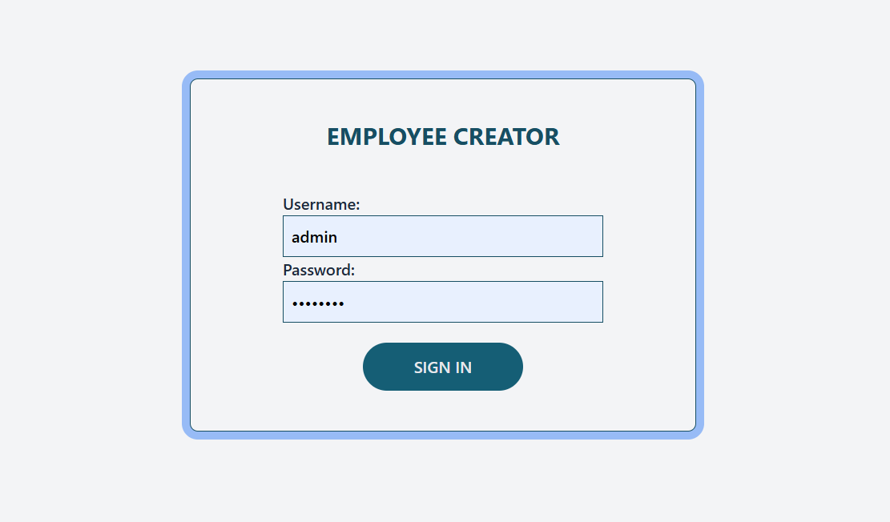
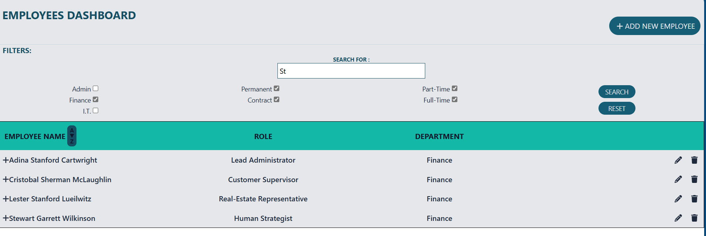
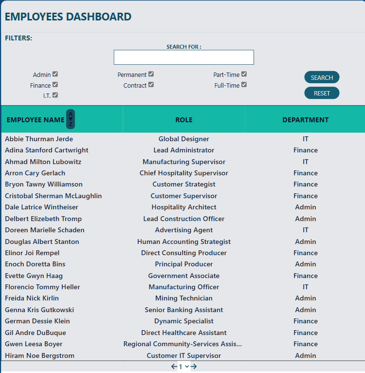
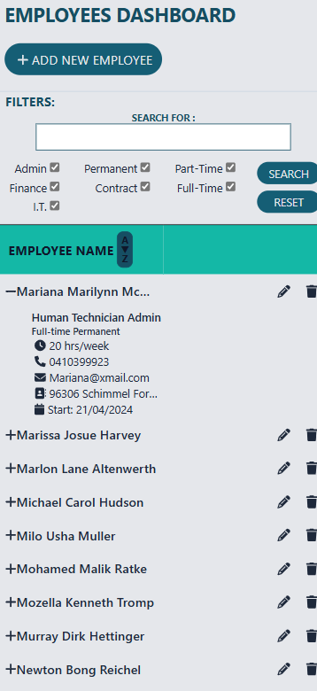
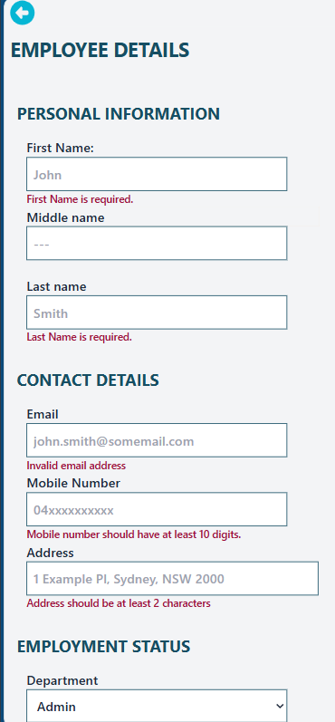
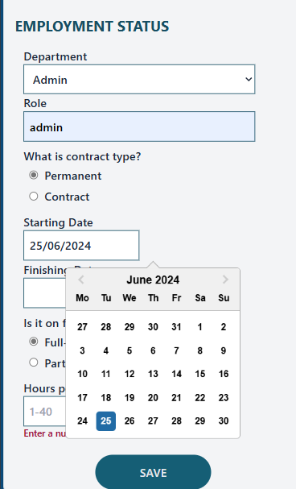
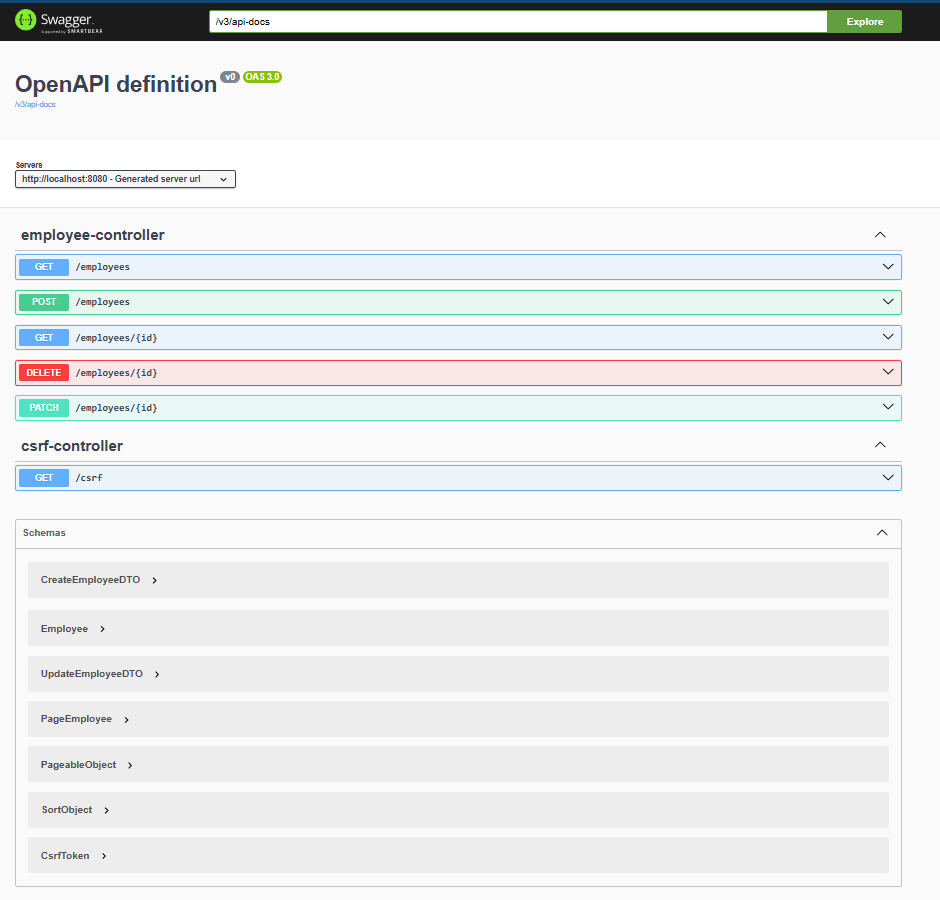

# Employee Creator
[](https://github.com/Ammara-Haroon/employee-creator/actions/workflows/main.yml)
[](https://github.com/Ammara-Haroon/employee-creator/actions/workflows/maven.yml)
## Demo & Snippets
To view the demo through docker, clone the repo and run the following command int the root directory
```docker compose up --build```
App will be available at http://localhost:5173 . Backend API is available http://localhost:8080 and Swagger Documentation can be viewed at http://localhost:8080/swagger-ui/index.html. Reset the assigned ports in compose.yaml file if required.
Login: 
            _User ADMIN_                              _User 2_
username: admin password: password           username: user password: password
### Login Page

### Dashboard with search and filters

### Ordinary User View without Edit, Delete and Add

### Employee Description

### Employee Edit/Add Form With Error Handling


### Sawagger Documentation


## Project Description
To create a web application that creates, lists, modifies and deletes employees.

## MVP
The application should consist of a spring RESTful API and a React Typescript frontend.
Backend should have at least three end points:

- create
- get all employees
- delete an employ

## Stack Used
JAVA Spring (back-end)
Typescript (front-end)
MySQL (Database)

## Build Steps
1. Clone the repo

` git clone https://github.com/Ammara-Haroon/employee-creator.git`

2. Go to the repo folder and to directory _backend_ and install dependencies

` npm install`

3. Create a database in MySQL to hold app data
4. Add _resources_ folder to backend\src\main and create a file _applicaton.properties_ with the following content (replace credentials and check localhost and port number for MySQL)

```spring.application.name=todo
spring.datasource.url=jdbc:mysql://localhost:3306/NAME_OF_DATABASE_FROM_PREVIOUS_STEP
spring.datasource.username=root (OR USER_NAME)
spring.datasource.password=YOUR_PASSWORD
spring.jpa.hibernate.ddl-auto=update
logging.pattern.console=%date{ISO8601} %-5level %class{0}:%L -[%M] %msg%n
logging.file.name=application.log
```

5. To run backend run the spring boot app. Server runs on port 8080 by default.
6. Go to directory _frontend_ and install dependencies

` npm install`

7. Create an .env file in the directory _frontend_ with the following contents.

`VITE_APP_BACKEND_BASE_URL=http://localhost:8080`

8. To run the front-end use:

` npm run dev`

- The app runs on localhost:5173 by default. If it runs on different port, CORS permissions need to be reset in backend\src\main\java\com\projects\backend\config\WebConfig.java.
- Swagger API documentation is available at http://localhost:8080/swagger-ui/index.html

## Design Goals / Approach

The main goal of the project are to learn and incorporate new/different tools than what I had used in my previous projects.
- Use Redux instead of useContext to manage states int the front end
- Use axios instead of fetch to make API calls
- Learn to us Tanstack Query/ React Query library 
- Learn to run the whole app in a docker container
- Learn controller testing for Java Spring
- Learn to use custom queries with JPA Repository
- Start exploring Java Spring Security
- Implement Pagination

The project was implemented with these goals in mind and the main purpose was to experiment with tools I have not been exposed to before.
### FrontEnd
- Authentication from server-side is used to render elements on the page. Add, delete, edit and view more buttons are displayed for an admin user only.
- *CSRF* token is retrieved from backend and added to subsequent server calls as a header value and cookie. 
- The filters are based on 3 different fields along with a search and sort for names. These all form query parameters to the API call to the backend and Redux is used to manage them.
- Whenever filters change the query parameters in *Redux* are updated. These are linked to *TanStack* get query arguments which uses *axios* to make API calls.
- *React Form* is used as an edit/ add employee form and error handling is done using *zod* resolver
- *useRef* is used to read data from filters and login forms
- Employee data is brought in form of _pages_. In order to test pagination, *data faker* library was used to seed data in the database.

### Backend
- Basic form login authentication is done through *Java Spring Security* by defining SecurityConfig class and adding SecurityFilterChain. Two users with role "user" and "admin" are defined in memory. 
- CSRF Token authentication is also enabled
- Added an Employee controller to manage CRUD operations
- Used Validation I/O and annotations to implement basic validations
- Created custom validator annotations to validate enum values
- Used ModelMapper to clean and created custom converters to map incoming data in data transfer objects (CreateEmployeeDTO, UpdateEmployeeDTO) to entity Employee.
- The validations on DTOs include:
  - All fields except middle name and finish date must be non-null for CreateEmployeeDTO. This is achieved by using Not-Blank annotation.
  - String fields (like first name) must contain at least 1 non-white-space character. This achieved by using Pattern annotation.
  - Address must have at least two non-white-space characters.
  - Email is validated to be of proper format by using Email annotation.
  - Mobile number must be only numbers with minimum length 8 and maximum length 20
  - Number of hours worked should not be less than 1 and greater than 40.
  - Dates should be of format yyyy-MM-dd
  - Custom Validators are implemented to validate contract type and employment type to match a set of enum values.
- The converters used by model mapper perform the following cleanup conversions:
  - All strings are trimmed
  - All names are converted to proper case
  - Addresses are converted to title case
  - Employment and contract types are converted to respective enum values
  - Date strings are converted to dates
- Get implements filtering based on various fields for which a custom SQL query is used inside JPA repository.
- Pageable is used to manage paging and sorting 

 ### Testing
  - *Mockito* and *MockMVC* are used for backend controller testing.
  - *React Tetsing Libarary* and *Vitest* are used for front end testing

## Features
- _Authenticates_ the user before giving him access to the dashboard
- The users can have a "user" _role_ or an "admin" role. 
- _Add, Delete, View More and Edit rights_ are only available to admin
- Admin can add and edit the _employee form page_
- _Filtering_ can be done on various fields
- _Search_ is available for names
- _Sorting_ by names is also available  
- _Responsive_ frontend- The columns of the table disappear as the screen size becomes smaller.


## Known issues

- Role and department fields were added towards the end of the project. For simplicity, they are a part of Employee entity. The employee entity should be normalized to separate out departments.
- Authentication is simplistic right now. I want to explore it further. I want to encorporate csrf token authentication to start with.

## Future Goals

- Normalize Employee entity
- Integrate CSRF Token authorization
- Integrate JWT Token authorization

## Change logs

### 05/06/2024

- Created Employee Controller managing CRUD
- Added ModelMapper and DTOs
- Added Exception handling
- Added custom Validators in DTOs and custom Converters to Model Mapper

### 06/06/2024

- Added swagger to auto-document API
- Added test cases at backend to test Employee Controller

### 07/06/2024 - Built a basic employee form using react-hook-form

### 12/06/2024

- Added styling to frontend components
- Fixed DTO validations issues for finish date

### 14/06/2024
- Added paging
- Added login password authentication
### 18/06/2024
- Used data faker to seed database and test pagination
- Added filters and alphabetic sort
### 19/06/2024 - Added frontend testing
### 20/06/2024
- Fixed server sides tests to work with spring security
- Added new backend tests to get method to incorporate filter testing
- Created CI pipeline
# 27/06/2024 - Integrated csrf token authentication

## What did you struggle with?
 Learning so many new tools in a span of short amount of time was filled with roadblocks and general errors that anyone trying these tools for the first time might run into and therefore, things were not as quick if I had worked with something I was already familiar with. It definitely accelerated my learning and strengthened my confidence and motivation to dive into new tools. These are the few road blocks I faced:
- Redux definitely had more setup required than context but once it was set up, state store was really easy to use and expand. I had trouble updating objects in the store that I was able to debug later.
- It took me some time to setup my Frontend tests. I learned to wrap components in wrappers like browser router, tanstack query provider, redux provider in testing.
- Backend tests stopped working when I started using Spring Security. The solution was to add a mock security config bean to the tests.
